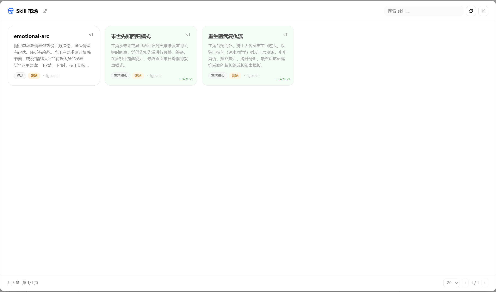
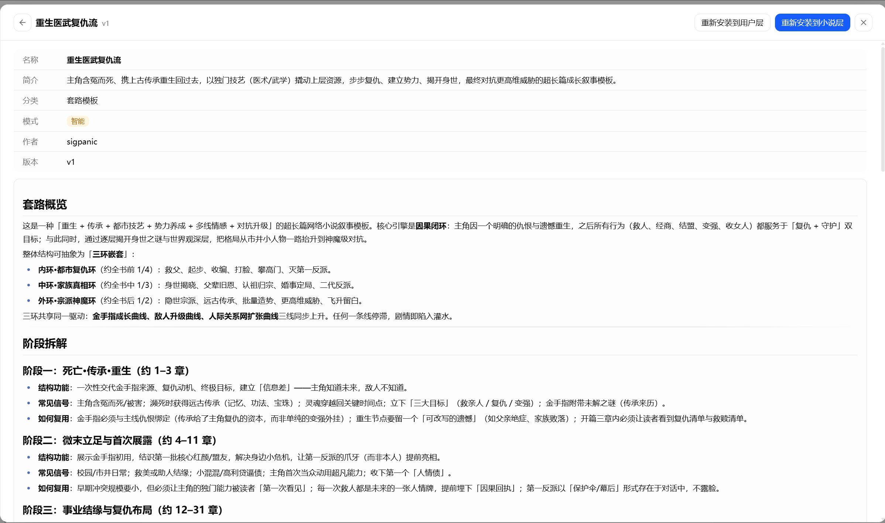

  
  

<h1 align="center">Goink 社区技能 创作方法论 × 社区贡献 × App 内一键安装</h1>

  
  

<strong><a href="README_EN.md">English Version</a> | 本文档为中文版</strong>

  <strong>这里是 <a href="https://github.com/sigpanic/goink">Goink</a> 桌面 AI 写作系统的社区技能仓库。</strong> 
  Skills 是 AI 写作助手的"专业知识卡片"，每条 skill 教 AI 一种特定的写作方法论或工作流。

## 在 App 中使用 Skills

> [!TIP]
> Goink App 内置技能市场，所有社区 Skills 都可以在 App 内浏览、搜索和一键安装。前往 [Goink](https://github.com/sigpanic/goink) 主仓库了解更多。

### 技能调用模式

每个技能的 `mode` 字段决定 AI 如何使用它：

| 模式 | 说明 |
|------|------|
| `auto` | AI 在创作过程中根据上下文自动调用匹配的技能 |
| `manual` | 在对话中手动触发 |
| `always` | 常驻注入，作为系统提示持续生效 |

### 技能层级

Skills 采用三层覆盖机制，同名技能按优先级生效：

- **builtin**：App 内置的基础技能（最低优先级）
- **user**：用户层技能（所有小说通用）
- **novel**：小说层技能（仅当前小说生效，最高优先级）

> 下载社区技能时，可选择安装到 **用户层** 或 **小说层**。

## 提交你的 Skill

> 提交前请先阅读 [CONTRIBUTING.md](CONTRIBUTING.md) 了解贡献条款、内容政策和侵权投诉流程。

1. **Fork** 本仓库
2. 在 `skills/` 目录下新建一个 `.md` 文件（参考 [.template/skill.md](.template/skill.md)）
3. 填写 YAML frontmatter 和正文内容
4. 提交 Pull Request

PR 合并后，系统会自动更新索引，所有 Goink 用户即可在 App 内浏览和安装你的 Skill。

## Skill 格式

每个 skill 是一个 Markdown 文件，文件头包含 YAML frontmatter：

| 字段 | 必填 | 说明 |
|------|------|------|
| `name` | 是 | 唯一标识，命名方式不限（中文 / 英文 / 拼音均可），如 `dialogue-subtext` 或 `末世先知回归模式`。**文件名必须与 `name` 一致**（即 `xxx.md`） |
| `description` | 是 | 一句话描述技能 + AI 何时应自动调用它 |
| `category` | 是 | 分类，如 角色、情节、文笔、结构 等 |
| `mode` | 是 | 固定为 `auto`。下载后可在 App 内改为 `manual`（仅手动触发）或 `always`（常驻注入） |
| `author` | 否 | 你的名字，可留空 |
| `version` | 否 | 整数版本号，从 1 开始（缺失默认 1） |

正文可以使用完整的 Markdown 语法：标题、列表、表格、代码块等。AI 会将正文作为系统提示注入到会话中。

## 分类参考

| 分类 | 适用范围 |
|------|----------|
| 角色 | 角色设计、性格塑造、人物关系 |
| 情节 | 情节编排、冲突设计、悬念营造 |
| 对白 | 对话写作、潜台词、语气把控 |
| 文笔 | 描写技巧、文风打磨、修辞手法 |
| 结构 | 篇章架构、节奏控制、章节规划 |
| 工具 | 写作辅助工具、流程优化方法 |

## 注意事项

- `name` 不要与已有的 skill 重复（目前内置 skill 使用 `builtin` 作为 author）
- 正文尽量具体、可操作，AI 会严格按正文内容执行
- 保持一条 skill 聚焦一个主题，不要塞入多个不相关的方法论
- 提交后维护者会 review，通过后合并到主仓库

## 许可

提交到本仓库的 skill 采用 [CC BY-SA 4.0](LICENSE) 许可——署名 + 相同方式共享。
